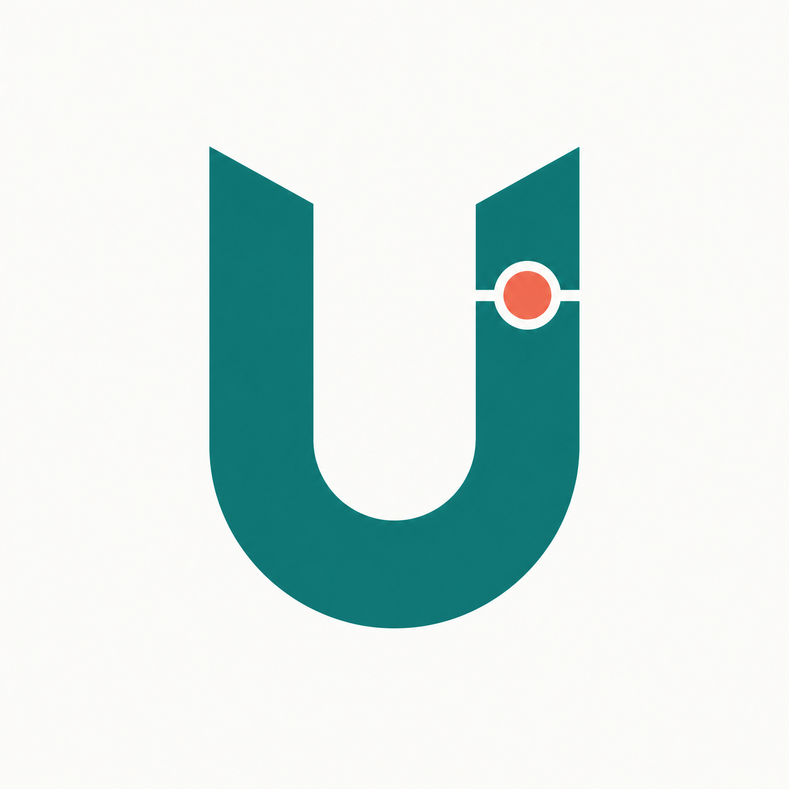

# Umer Sajid — Portfolio Identity Kit

## Identity decision

> **Quiet technical clarity.** The portfolio should make the work easy to inspect, not compete with it: concise claims, visible methods, public evidence, and one clear next action.

This kit is for Umer Sajid’s entry-level machine-learning portfolio. It supports the existing leakage-aware content-prioritisation case study, which reports an improvement in Precision@50 from **0.340** for the baseline to **0.540** for the model on seven held-out clients.[1]

| Element | Decision | Use |
|---|---|---|
| Display + body font | **Manrope** (Google Fonts) | Headings, navigation, body copy, captions, and data labels. Its open counters and even spacing retain clarity at portfolio and mobile sizes. |
| Main colour | `#0F766E` — deep teal | Links, primary buttons, active navigation, small visual anchors. |
| Text | `#172033` — near-black navy | Primary reading text and chart labels. |
| Background | `#FAFAF8` — warm off-white | Page canvas; keeps the site calm without reducing contrast. |
| Accent | `#F9735B` — coral | One data-point accent, status emphasis, or an important result only. It is never used for body text. |
| Mark | Teal **U** monogram with a coral data-point accent | Favicon, profile/avatar fallback, and compact navigation mark. |

## Name treatment

**UMER SAJID** appears in Manrope ExtraBold or Bold, all caps only in compact navigation. On the hero and case-study pages, use title case: **Umer Sajid**. The role line is set in regular weight: *Machine Learning Intern — evidence-first content intelligence projects.*

## Two-line style note for the Claude Project

> Use a quiet technical portfolio style: Manrope typography, deep teal `#0F766E`, near-black `#172033`, warm off-white `#FAFAF8`, and coral `#F9735B` only as a focused result accent. Prefer concise evidence-first copy, generous whitespace, real project captures, accessible contrast, and a single clear action that leads to the case study.

## Usage rules

| Do | Avoid |
|---|---|
| Lead with the case-study result, then explain the method and limitation. | Decorative gradients, stock AI imagery, or a colour palette that overwhelms evidence. |
| Use teal for actions and coral for a single important number or dot. | Coral body text, multiple accent colours, or competing calls to action. |
| Use the U monogram only at small scale and preserve its empty margin. | Replacing real work captures with generated illustrations. |
| Keep content readable before adding motion or visual effects. | Claiming production impact beyond the public capstone evidence. |

## Evidence and remaining personal action

The identity choices, mark, and style note are complete and versioned here. The Claude Project style note must be pasted into Umer’s personal Claude Project by Umer, because it requires access to his authenticated account. This is intentionally recorded as a personal-account action rather than falsely marked complete.

## References

[1]: https://github.com/UmerSajid842/flyrankmlproject/blob/main/work/capstone_report.md "Umer Sajid — leakage-aware content-prioritisation capstone report"
