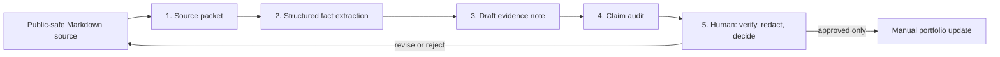

# Ship an Automation Workflow v2 — Evidence Writing with a Claim Audit

**Assignment:** `FL-04`  
**Author:** Umer Sajid  
**Status:** Working, local, and deliberately non-publishing  
**Run date:** August 13, 2026

## Purpose and boundary

This workflow turns a **public-safe Markdown source** into a structured evidence packet, a short draft note, and a claim audit. Its job is to accelerate the repetitive first pass of portfolio writing without turning unreviewed AI output into a published claim. It does not browse, edit source documents, commit files, deploy a site, or publish anything. The workflow stops at a required human check.

## Workflow diagram and handoffs

| Step | Owner | Input → output | Handoff rule |
|---|---|---|---|
| 1. Source packet | Script | A named local Markdown file → clean text limited to 18,000 characters. | Obvious secret-like values are redacted before the AI calls. |
| 2. Fact extraction | `gpt-5-mini` | Source packet → purpose, verified facts, limits/unknowns, and artifacts. | The next step receives only the structured extraction, not an instruction to invent facts. |
| 3. Draft | `gpt-5-mini` | Extracted facts → a 55–85 word evidence note labeled “draft for human review.” | The prompt forbids claims beyond the extracted facts. |
| 4. Claim audit | `gpt-5-mini` | Draft plus extracted facts → supported claims, risks, and required human check. | Every audited result remains `not_published_human_review_required`. |
| 5. Human review | Umer | Source, extraction, draft, and audit → publish/revise/discard decision. | The only step that can authorize a portfolio update. |

## Configuration and every AI prompt

The reproducible implementation is [`run_evidence_workflow.py`](./run_evidence_workflow.py). It uses the live model catalog’s `gpt-5-mini` entry and the OpenAI-compatible sandbox connection. It runs three AI calls per source and writes both a readable Markdown report and a JSON record containing token counts.

> **Shared system instruction:** “You are a careful evidence assistant. Use only statements directly supported by the supplied source. Never invent metrics, people, URLs, actions, or outcomes. When support is missing, say so.”

> **Step 2 prompt:** “STEP 1 — SOURCE PACKET. Source name: `[filename]`.” The full input follows. The required JSON fields are `source_purpose`, `verified_facts`, `limits_or_unknowns`, and `publishable_artifacts`.

> **Step 3 instruction:** “Write a 55–85 word draft portfolio evidence note using only the verified facts provided. Do not make performance claims beyond the facts. Mention a limitation when it is material. This is a draft for human review, not publication.”

> **Step 4 prompt:** “STEP 3 — CLAIM AUDIT. Audit this draft against the extracted facts. The output must require human review even if the draft is supported.” The required JSON fields are a status, supported claims, risks/missing support, and one required human check.

## Five real end-to-end runs

All five inputs were real public-safe work files already used in this portfolio project. Each generated its own extraction, draft, audit, JSON record, and Markdown record under [`runs/`](./runs/).

| Run | Real input | Automated time | Audit outcome | Output |
|---|---|---:|---|---|
| 1 | Anonymized capstone model report | 73.38 seconds | `revise_before_review` | [Markdown](./runs/capstone_model_report.md) · [JSON](./runs/capstone_model_report.json) |
| 2 | Week 3 identity kit | 79.67 seconds | `revise_before_review` | [Markdown](./runs/identity_kit.md) · [JSON](./runs/identity_kit.json) |
| 3 | Week 3 image-curation rationale | 59.75 seconds | `revise_before_review` | [Markdown](./runs/image_curation.md) · [JSON](./runs/image_curation.json) |
| 4 | Week 3 content and CTA map | 58.53 seconds | `revise_before_review` | [Markdown](./runs/content_cta_map.md) · [JSON](./runs/content_cta_map.json) |
| 5 | Week 4 stack decision | 70.13 seconds | `revise_before_review` | [Markdown](./runs/stack_decision.md) · [JSON](./runs/stack_decision.json) |

The total observed automated runtime was **341.46 seconds (5 minutes 41 seconds)** for five sources. The manifest is available at [`runs/run_manifest.json`](./runs/run_manifest.json).

## Time accounting

The automatic portion averages **68.29 seconds per source**. I did not run a controlled, independent manual baseline, so I will not claim a precise number of minutes saved or a positive net saving. A careful manual process would still require reading the source, drafting, and fact-checking it, but that is not the same as a measured experiment.

The setup cost is also material: writing and testing the script, defining schemas, choosing safe source files, and reviewing the five outputs took more work than a one-off summary. Therefore, the honest current estimate is **net time saved: unknown/not yet established**. The workflow becomes worthwhile only if it is reused for enough similarly structured sources that the fixed setup cost is spread across later runs. It is valuable now because it creates repeatable evidence packets and explicit review gates, not because it claims to eliminate human work.

## Known failure points and mandatory human checks

| Failure point | Why it matters | Required check |
|---|---|---|
| A source contains private or identifying material | The model may repeat it in an extraction or draft. | Use only public-safe sources; scan source and output before sharing. |
| A “verified fact” is copied with insufficient context | Correct numbers can still produce a misleading story. | Compare every draft sentence to the original source and restore material limitations. |
| The model invents an inference or compresses nuance | Structured output reduces this risk but does not remove it. | Treat `revise_before_review` as a real stop signal; revise or discard unsupported text. |
| A planned asset is described as complete | Portfolio work can change between planning and publishing. | Verify the linked artifact or live URL exists now. |
| Automation is mistaken for approval | The workflow has no authority to publish. | A human must explicitly select publish, revise, or discard after review. |

## How to reproduce

1. Ensure the source paths listed near the top of `run_evidence_workflow.py` point to public-safe Markdown files.
2. Run `python3 ai_fluency/FL-04/run_evidence_workflow.py` from the repository root.
3. Read the corresponding Markdown report and JSON record inside `ai_fluency/FL-04/runs/`.
4. Do the required source, privacy, and claim review before manually using any draft.

The script contains no publishing code by design. This makes the workflow a safer foundation for later agent work: a future version could select which source needs review, but it should keep the same narrow file access, explicit limits, and human approval gate.
