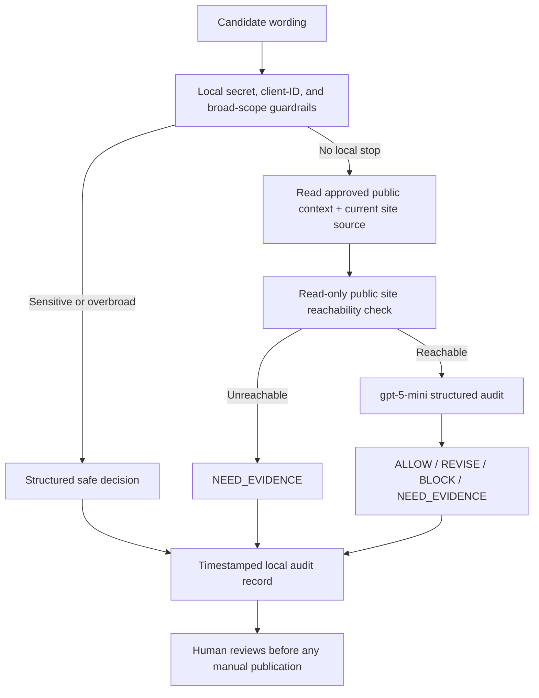

# Evidence-Safe Portfolio Update Scout

A small, **read-only personal agent** for reviewing proposed public ML portfolio wording against Umer Sajid’s approved public-safe case-study context.

The agent’s purpose is to protect evidence quality before a human updates a public portfolio. It can classify a candidate sentence as `ALLOW`, `REVISE`, `BLOCK`, or `NEED_EVIDENCE`, explain why, and offer one safer replacement only when a revision is appropriate. It is not a content publisher.

## Audience and use

The intended user is Umer Sajid, working on entry-level ML portfolio updates. Use it before adding a result sentence to the public site, a case study, a short application summary, or a source-linked note. It is designed for a small, repeatable job: compare candidate wording with the approved case-study boundary and refuse unsupported or sensitive claims.

## Required public-safe inputs

| Input | Location | Role |
|---|---|---|
| Approved case-study context | `../../claude_project/portfolio_case_study_context.md` | Defines the verified Precision@50 result, prototype boundary, approved claim, and forbidden claim types. |
| Current public home-page source | `../../../docs/index.html` | Gives the agent the active public framing. |
| Candidate text | Command-line argument or a UTF-8 text file | The sentence or short paragraph to audit. |
| Public site URL | Fixed `https://flyrank-ai-fluency-public-site-umer-sajids-projects.vercel.app/` | A read-only reachability check; it does not authenticate or deploy. |

Do not provide datasets, client names, client-identifying details, credentials, private notebooks, raw queries, passwords, API keys, or other secrets.

## Setup

This project is a Python CLI. It needs Python 3.11+, the `openai` package, and environment variables for an OpenAI-compatible endpoint:

```bash
export OPENAI_API_KEY="your-key"
export OPENAI_API_BASE="https://your-compatible-endpoint/v1"
pip install openai
```

The implementation uses `gpt-5-mini` for its structured decision step. Before substituting a model, verify that it exists in the active provider catalog and test the JSON-schema output.

## Run a review

From the repository root:

```bash
python3 ai_fluency/FL-07/agent/audit_portfolio_copy.py \
  "On seven held-out clients, the model reported Precision@50 of 0.540 versus 0.340 for the baseline."
```

The agent stores a timestamped JSON audit record in `agent/runs/`. The record contains the candidate wording, read-only live-site check, structured decision, and an explicit statement that nothing was published.

A short paragraph can be supplied from a file:

```bash
python3 ai_fluency/FL-07/agent/audit_portfolio_copy.py \
  --input-file candidate_update.txt
```

`--skip-live-check` is available only to test the expected `NEED_EVIDENCE` behavior when the live destination is not verified.

## Architecture



## Guardrails and limitations

| Guardrail or limitation | What it means in practice |
|---|---|
| No write tools | The agent cannot edit the site, deploy, commit, post, email, book, or send anything. |
| Public-safe packet only | The model sees only an approved Markdown context file and current public home source. |
| Local sensitive-input stop | Obvious credential terms and apparent client/customer identifiers are blocked before the model call. |
| Reachability is not quality | A successful HTTP check confirms only that the URL responded; a human must still review content, layout, accessibility, and link targets. |
| Advisory output | Every output requires human review. An `ALLOW` is not permission to publish. |
| Narrow evidence base | The tool cannot verify a new metric, job title, production claim, or business outcome absent from the approved packet. It will ask for evidence instead. |

## Test evidence

The v2 agent was run on seven documented evaluation cases in `test_outputs/`; the expected evidence-safety behavior and the post-iteration Case 4 re-run are summarized in [`evaluation_results.md`](evaluation_results.md). The build record—including a genuine failed test-output path and the broad-scope guardrail iteration—is in [`../build_log.md`](../build_log.md).

## Demonstration status

A successful end-to-end CLI run has been completed with a real read-only request to the live public ML Work URL and a structured model response. The required **raw, unedited approximately two-minute screen recording** must be recorded by Umer; it is a personal action and is not fabricated in this repository. For the Week 8 3–5 minute narrated demonstration plan, see [`../../FL-09/documentation_and_demo_video.md`](../../FL-09/documentation_and_demo_video.md).
